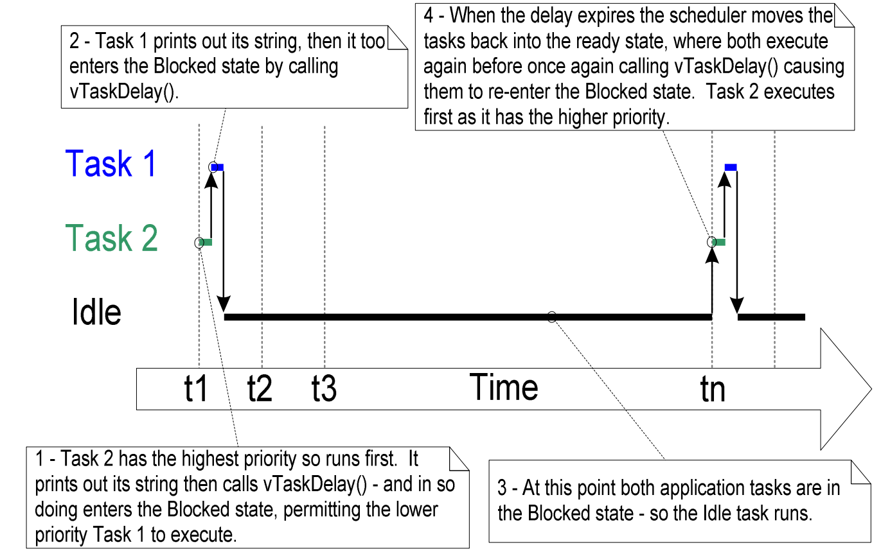

# # Documentación Trabajo Práctico N° 3

**Seminario de Electrónica: Sistemas Embebidos**

**LPC43xx Entradas y Salidas (Digitales) de Propósito General (GPIO) – Diagrama de Estado**

Objetivo:  
• Uso del IDE (edición, compilación y depuración de programas)  
• Uso de GPIO & FreeRTOS (manejo de Salidas y de Entradas Digitales en Aplicaciones)  
• Documentar lo que se solicita en c/ítems

## 1. Estructura de archivos

Las carpetas de cada proyectos importados tienen la misma estructura.

| Archivo | funcion |
| ----- | ---- |
| Project settings | Parametros del proyecto segun el "project.mk". |
| Binaries |  Un archivo ".axf" que incluye informaciones de debug y de codigo objeto. |
| Includes | Incluye los plug-ins para el funcionamiento de la aplicacion.  |
| Example |  En esta archivo tenemos un archivo "inc" que incluye una libraria RTOS y un archivo "src" que incluye el codigo fuente de la aplicacion (.c), un codigo "sysinit.c" que permite la inicialisacion del sistema segun el core (core-M3 o M4) y la placa, y un codigo que es un código de inicio del microcontrolador para su uso con LPCXpresso IDE. Para terminar tenemos el archivo que define las opciones de configuración de OpenOCD) y el "readme" que nos indicamos el funcionamiento de la aplicacion.|
| FreeRTOS |  Aca tenemos todas la librerias para el funcionamiento de freeRTOS. |
| Debug |  En este archvio estan los codigos objetos (.o), los archivos de debug y de configuracion. |

```
codes examples
```

### freertos_examples_1_to_9

El archivo (.c) se puede desglosar así:
* Enumeracion de la variables privadas. Estos son #define que permiten eligir la parte del codigo que queremos ejecutar.
* Funcion privada de setup del hardware.
* Condiciones sobre el valor de una variable que tiene un valor correspondiente al ejemplo que queremos ejecutar.
	* EXAMPLE1
	* EXAMPLE2
	* EXAMPLE3
	* EXAMPLE4
	* EXAMPLE5
	* EXAMPLE6
	* EXAMPLE7
	* EXAMPLE8
	* EXAMPLE9
	
El archivo "readme.txt" permite entender el funcionamiento y los parametricos de la aplicacion.
* Descripcion del ejemplo.
* Configuracion del hardware.
* Como hacer un 'build' del proyecto.

### freertos_examples_10_to_16

El contenido de este archivo es igual al del archivo anterior.

### lcp_chip_43xx

Este archivo contiene los codigos (.c y .h) para el uso de los perifericos del sistema. (gpio, adc, i2c, timer, ...)

### lcp_board_nxp_lpcxpresso_4337

El ultimo archivo contiene los control de driver de la placa EDU-CIAA-NXP, como el lcd o los entradas y salidas.

### Secuencia de funciones del ejemplo 1

| funciones | archivo | descripcion | efecto |
| ----- | ---- | ---- | ---- |
| prvSetupHardware() | freertos_examples_1_to_9.c | Parametra el sistema hardware | Llama a funciones de inicialisaciones que estan en librerias relacionadas con el hardware, como LPC18xx/43xx GPIO driver que pilota los pines de hardware.  |
| DEBUGOUT(pcTextForMain) | board_api.h | funcion de debug, muestra el estado de debug| Funcion que depende de los paramtros de configuracion del sistema. |
| xTaskCreate(vTaskCode, "NAME", STACK_SIZE, &ucParameterToPass, tskIDLE_PRIORITY, &xHandle) | task.c/.h | Crea la tarea, memoriza el handle, asigna prioridades. | Es part of freeRTOS distribucion que provee un software robusto y estándar |
| vTaskStartScheduler() | tasks.c/.h | Inicia el procesamiento en tiempo real, tiene control sobre qué tareas se ejecutan y cuándo. | Es igualmente part of the freeRTOS distribucion. |

*prvSetupHardware()*:
	/explicar

*DEBUGOUT(...)*:
	/explicar

*xTaskCreate(...)*:
	/explicar

*vTaskStartScheduler()*:
	/explicar

## 2. Ejemplos del 1 al 9

### Ejemplo 1
En este primer ejemplo, se crean las tareas _task1_ y _task2_ con la misma prioridad. Además cada tarea esta en condiciones para ejecutarse, por lo tanto _scheduler_ hace una transición entre las tareas para que corran por turnos. Cada una de las tareas se ejecutarán para un segmento de tiempo ("_time slice"_), en el cual pasará al estado de ejecución al comienzo de cada segmento y sale del estado de ejecución al finalizar el segmento de tiempo. En la siguiente imagen se muestra el diagrama temporal donde se muestran los tiempos de ejecución.


### Ejemplo 2
En si, este segundo ejemplo es muy parecido al ejemplo anterior. Es más la salida es la misma.  La única diferencia es que en este ejemplo se crean dos instancias de la misma activadad. Es decir hay una sola actividad que se implementa tanto para la actividad 1 y la actividad 2. La función de la tarea es: static void vTaskFunction(void *pvParameters) y a traves del parámetros pvParameters se pasa el _string_ a imprimir. En sí el gráfico de tiempos de tareas es el mismo. El que se muestra a conituación tiene, además, la ejecución del kernel cuando hace el traspaso de una tarea a otra.


### Ejemplo 3
En este caso la tarea 2 se crea con una mayor prioridad y como nunca pasa al estado de bloqueo, siempre se ejecutara esta tarea. Esto se muestra en la siguiente imagen, que como en el ejemplo anterior tambien se muestra la tarea del kernel para cada _time slice_.

### Ejemplo 4
Al igual que en el ejemplo 3, se crea una tarea con prioridad 1 y otra con prioridad 2, pero se usa la función vTaskDelay() que bloquea  la función una vez ejecutada hasta que el periodo del delay haya expirado. Por lo tanto primero se ejecuta la tarea 2  (ya que tiene mayor prioridad) y cuando se bloquea se ejecuta la tarea 1 que al imprimir su _string_ se bloquea y como no quedan más tareas el kernel crea la tarea IDLE. Vale la pena mensionar que el parámetro que se le pasa al a tarea vTaskDelay especifica el número de _ticks interruprs_ que deberían ocurrir entre una tarea que llama la funcion vTaskDelay() y la misma tarea que va a llamar una vez que haya transitado el estado de bloqueo, que en este caso serían 250ms. En la sigueinte imagen se muestra el patrón de ejecución de este ejemplo.

### Ejemplo 5
Para este ejemplo, en vez de usar la función vTaskDelay() se utiliza la función vTaskDelayUntil() que especifica la cantidad exacta de cuantos _ticks_ en el que se debe mover la tarea del estado bloqueado al estado listo para ejecutarse. Es la API a utilizar cuando se requiere un período de ejecución fijo. El gráfico es exactamente igual al del ejemplo 4.

### Ejemplo 6
Esta aplicación cree dos instancias de la tarea de tratamiento continuo, ambas en la prioridad 1, y una otra de la tarea periódica con una prioridad 2 más alta. Como las dos instancias están de tareas continuadas, solo se paran cuando la tarea de prioridad más alta pasa por el estado “Ready”. Así la tarea “Idle” nunca va a entrar en el estado “Ready” porque siempre hay tareas de estado más alto corriendo. Lo vemos en el siguiente gráfico.

### Ejemplo 7
El ejemplo 7 cree una primera tarea con prioridad uno y una secunda con una prioridad 2. Las prioridades están definidas más alta que la prioridad de la tarea “Idle”.

### Ejemplo 8
En este caso, las prioridades están dadas para la tarea 1 y la tarea 2 respectivamente alta y baja. dentro de cada tarea, la prioridad se cambia por una más baja para la tarea 1 y por una más alta para la tarea 2. Así la primera tarea está en el estado “Running” hasta que cambia su propia prioridad. Entonces pasa la tarea 2 en el estado “Running” también hasta que baja su propia prioridad. Las dos tareas van a correr una cada una como muestra el grafico siguiente.

### Ejemplo 9
La aplicación cree la tarea 1 con la prioridad más alta. Así se ejecuta en primero. Dentro de la tarea 1 se crea la tarea dos que se ejecuta. Pero la única cosa que hace es borrarse a sí misma. Regresamos a la tarea 1 que ejecuta un “vTaskDelay()”. Empieza la tarea “Idle” hasta el fin del “delay”. Vimos en el siguiente gráfico la secuencia que se repite.

## 3. Ejemplos del 10 al 16

### Ejemplo 10


### Ejemplo 11


### Ejemplo 12


### Ejemplo 13


### Ejemplo 14


### Ejemplo 15


### Ejemplo 16


## 4. Implementación de aplicación 1


## 5. Implementación de aplicación 2


## 6. Implementación de aplicación 3
